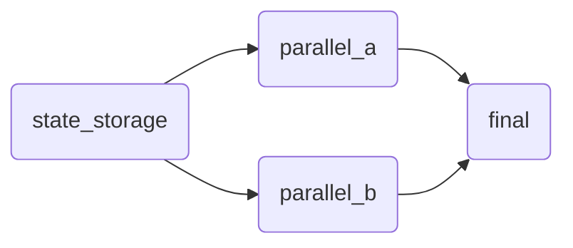

# Orchestrator

## Basic Operation

A user implements their tool as a library in a directory which looks something
like the following:

```
my_tool
├── config.libsonnet
├── betterform_dag.mk
├── stage_one
│   └── ctl
└── another_stage
    ├── ctl
    └── stuff.tf
```

- `config.libsonnet` is configuration that 
  stage both at stamp time and run time.
- `betterform_dag.mk` contains the DAG relating the stages. It's format is described below.
- `stage_one` and `another_stage` are stage template directories.

The user then calls their library from another directory like the following:

```
.../prod/eu-north-1/my_tool
├── config.jsonnet

```

The orchestrator:
- Reads the DAG from `$IMPL_DIR/betterform_dag.mk`.
- Reads each stage definition from `$IMPL_DIR/the_stage_name` and stamps it to
  `$GENFILES/the_stage_name`.
- Only stamps a stage once all its dependency stages have run successfully and
  produced their output (if any). This is required because the output of a
  dependency stage may be required to stamp the dependent stage.
- Never changes the current working directory.  It remains the same as when it
  was called.
- Converts the wave interface environment variables into absolute paths before
  calling a stage's `ctl`.
  - The wave interface environment variables are NOT changed per stage.
    `IMPL_DIR`, `OUTPUT_DIR`, etc will point to the same locations across all
    stages. If a stage should output to a stage specific directory, then it
    needs to do this itself.


## Stage

A stage is defined a directory under `$IMPL_DIR/containing a wave program which must be called
`ctl` and potentially other companion files.  All files in the directory are
interpreted as `gomplate` templates.  This directory is called the "stage
template directory".  It must live directly under `IMPL_DIR`.

The orchestrator "stamps" the entire stage template directory using `gomplate`
into `$GENFILES/the_stage_name`, which is called the "stage stamped directory".
It then runs the stage's `ctl` from there.

The stamped `ctl` must implement the wave interface, including the `up` and
`down` commands.

> ([`.gomplateignore`](https://docs.gomplate.ca/usage/#gomplateignore-files) may
> be useful, especially if including **Helm chart sources**)


## `betterform_dag.mk`

Callers must create `$IMPL_DIR/betterform_dag.mk` to define the DAG of stages.  The GNU
make macro `define_stage` must be used for this purpose. Here is an example
implementation to define this DAG:




```make
$(call define_stage, state_storage, )
$(call define_stage, parallel_a, state_storage)
$(call define_stage, parallel_b, state_storage)
$(call define_stage, final, parallel_a parallel_b)
```

In general `define_stage` is called like:
```make
$(call define_stage, THE_STAGE_NAME, SPACE_SEPARATED_DEPENDENCY_STAGES)
```

- `THE_STAGE_NAME` must be the name of a directory within `$IMPL_DIR`.
- `SPACE_SEPARATED_DEPENDENCY_STAGES` can be empty if there are no dependencies.
- extra whitespace is allowed, but line wrapping requires a backslash `\`.

## Details

The orchestrator will ensure the following before stamping and running stages:
- Environment variables:
  - `STAGE_NAME` is set to the stage name, which is the name of the stage
    template directory.
- For a given stage, all dependency stages will have completed successfully
  before it is stamped, so the dependency stage stamped files, genfiles and
  outputs are available. This means the following things could work:
  - At stamp time:
    ```
    {{ $x := print .Env.OUTPUT_DIR "/earlier_stage/output.json" | data.JSON -}}
    {{ $x.some.json.value }}
    ```
  - At run time:
    ```
    #!/usr/bin/env bash
    cat $OUTPUT_DIR/earlier_stage/output.json
    ```
  (Also similarly with `$GENFILES`)


## Using a standalone "Wave Program" as a stage.

A standalone wave program can be used as a stage by using a few line bash script
for the stage's `ctl` program.  For example:

```shell
#!/usr/bin/env bash
export GENFILES=$GENFILES/$STAGE_NAME
export OUTPUT_DIR=$OUTPUT_DIR/$STAGE_NAME
export CONFIG_JSON_FILE=$OUTPUT_DIR/some_prior_stage/stuff.json
# or... export CONFIG_JSON_FILE=$GENFILES/stuff.json
exec "$REPO_ROOT/foo/bar/my_standalone_wave" "$@"
```
(assuming `$REPO_ROOT` is set to something useful)

Key points:
- You don't have to override the "Wave Interface" env vars, but likely it will
  make sense for the sake of organization and to avoid collisions.
- The standalone wave program can live elsewhere, but the few line script that
  points at it must be implemented as a stage, meaning it lives in a "stage
  template directory".


## Future Work

- Run stages in parallel when possible.  This requires probably only a 1 line
  change to add `-j8` (or some other number) when calling `make`.  The number
  should probably be configurable via environment variable, and/or use nproc.

- Allow configure which files in a stage template directory should or shouldn't
  get processed by gomplate.  Use a syntax similar to `dockerignore` files.

- Allow configuring the `--left-delim` and `--right-delim` options of gomplate.

